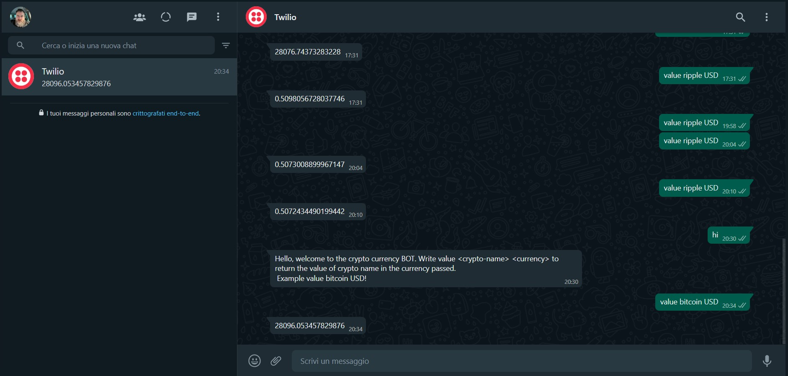

# Twilio WhatsApp crypto BOT

This is a simple WhatsApp messenger BOT using:
* Twilio service;
* Python Flask;
* NGROK;
* Coinmarketcap API.

## Installation guide
### First step setting Python virtualenv (Windows 11)

```bash
$ virtualenv -p python venv
$ source activate venv/Scripts/activate
$ pip install flask requests twilio
$ pip freeze > requirements.txt
```

### Flask

```bash
export FLASK_APP=app.py
```
**export TWILIO_ACCOUNT and TWILIO_TOKEN private keys**  
`export TWILIO_ACCOUNT='secret-word'`
`export TWILIO_TOKEN='secret-word'`

execute flask:  
`flask run`  

### Ngrok

Download and install [ngrok](https://ngrok.com/).  
  
`./ngrok http 5000 #use the port of Flask in my case 5000`

## Bot in action

Start flask with the command:  
`flask run`  

type in the chat:
`hi`  

You will receive a message that explaine how to use this simple bot.  

In particular, for now this is a simple BOT that could be used to know the current value of a crypto currency in the wanted currency.  
For example to know the value in USD of bitcoin:
`value bitcoin USD`  

  

## Simple BOT architecture

  

:sunglasses: :octocat: :ghost: